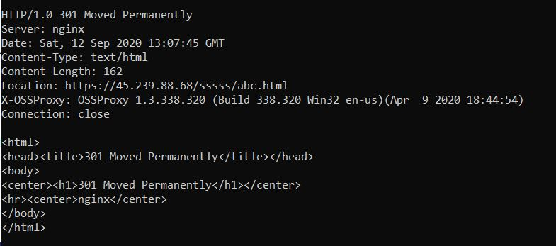
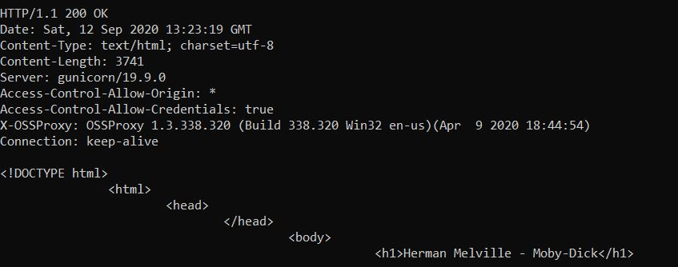
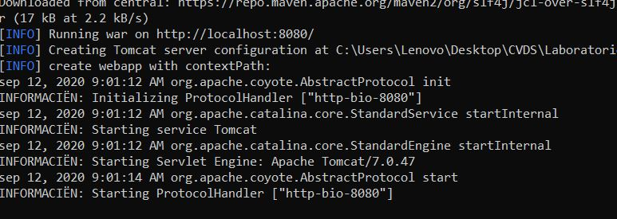
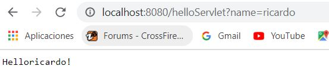
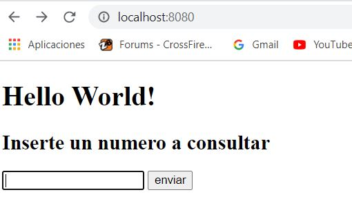
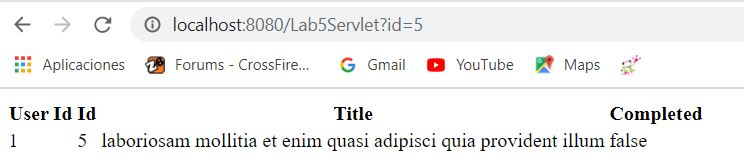
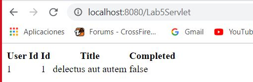

# Laboratorio 5

### Telnet escuela

*Nos aparece el error 301 Moved Permanently significa que los enlaces o registros actuales
ue utilizan la URL para la que se recibe la respuesta deben actualizarse.*

*Qué otros códigos de error existen?¿En qué casos se manejan?*
### Codigos de Error:
* Error 100: Esta respuesta provisional indica que todo hasta ahora está bien y que el cliente debe continuar con la solicitud o ignorarla si ya está terminada.
* Error 200: La solicitud ha tenido éxito. El significado de un éxito varía dependiendo del método HTTP:
* * GET: El recurso se ha obtenido y se transmite en el cuerpo del mensaje.
* * HEAD: Los encabezados de entidad están en el cuerpo del mensaje.
* * PUT o POST: El recurso que describe el resultado de la acción se transmite en el cuerpo del mensaje
* * TRACE: El cuerpo del mensaje contiene el mensaje de solicitud recibido por el servidor.
* Error 400: Esta respuesta significa que el servidor no pudo interpretrar la solicitud dada una sitaxis inválida.
* Error 500: El servidor ha encontrado una situación que no sabe como manejarla.

### Telnet www.httpbin.org

*El resultado obtenido es un archivo html con el titulo "Herman Melville - Moby Dick" y un texto dentro de una capsula div*

Obtenemos como resultado el codigo 200 que significa que la solicitud ha tenido exito en este caso el recurso se ha obtenido de manera correcta

El archivo HTML tiene 3741 palabras usando el comando wc -c

*¿Cuál es la diferencia entre los verbos GET y POST? ¿Qué otros tipos de peticiones existen?* HTTP define un conjunto de métodos de petición para indicar la acción que se desea realizar para un recurso determinado.

### GET
solicita una representación de un recurso específico. Las peticiones que usan el método GET sólo deben recuperar datos.

### POST
se utiliza para enviar una entidad a un recurso en específico, causando a menudo un cambio en el estado o efectos secundarios en el servidor.

### HEAD
pide una respuesta idéntica a la de una petición GET, pero sin el cuerpo de la respuesta.

### PUT
reemplaza todas las representaciones actuales del recurso de destino con la carga útil de la petición.

### DELETE
borra un recurso en específico.

### CONNECT
establece un túnel hacia el servidor identificado por el recurso.

### TRACE
realiza una prueba de bucle de retorno de mensaje a lo largo de la ruta al recurso de destino.

### OPTIONS
es utilizado para describir las opciones de comunicación para el recurso de destino.

¿Cuáles son las diferencias con los diferentes parámetros curl -v y -i?

* El comando curl -v nos muestra una informacion completa de la peticion GET realizada y el estado de la peticion en este caso 200 exitosa
* El comando curl -i nos muestra solo la informacoin completa del estado de la peticion en este caso 200

# Parte ll.- Haciendo una aplicación Web dinámica a bajo nivel.

### Compile y ejecute la aplicación en el servidor embebido Tomcat, a través de Maven:

### Agregando parámetro GET

# Parte III.

*Creando formulario para ingresar el número*

La diferencia usando GET es que se muestra en la dirección URL la consulta con el parametro seleccionado

Usando el método POST no se muestra la consulta, lo hace de forma oculta

¿Qué se está viendo? Revise cómo están implementados los métodos de la clase Service.java para entender el funcionamiento interno.

En la clase Service encontramos 3 metodos:

* getTodo: Nos permite obtener todos los datos que necesitamos en este caso Id, UserId, Title, Completed pero esta información está en JSON (JavaScrip Object Notation) y luego por medio de Google Gson nos permite pasar de una representación JSON a un objeto java.
todoToHTMLRow y todosToHTMLTable lo que nos permite es coger los objetos java que transformamos en el método anterior y convertirlos en HTML con un estilo de tabla para que el navegador nos pueda mostrar esta información.